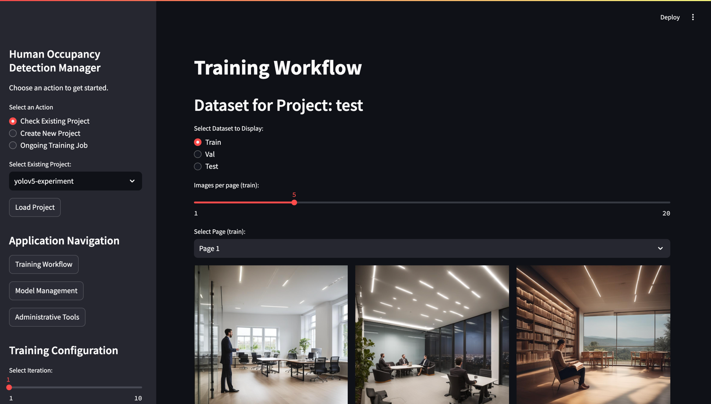
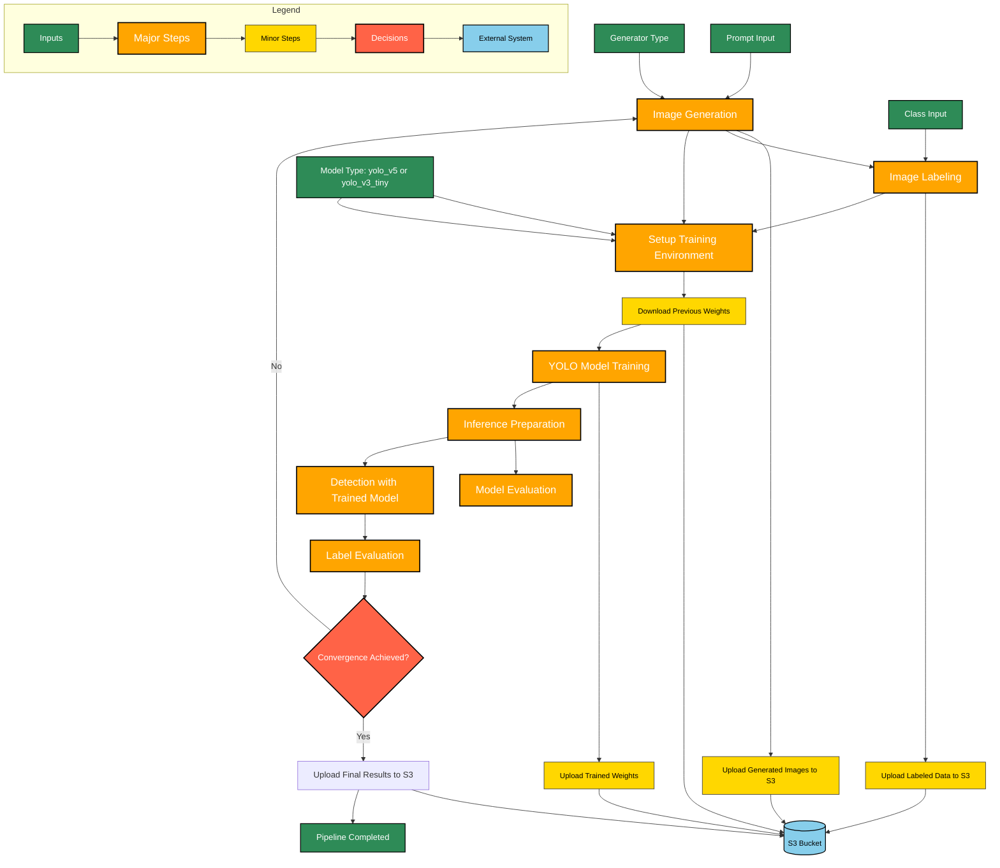

# Prompt2YOLO

Prompt2YOLO is an automated pipeline designed specifically for generating training data using prompts and fine-tuning YOLO models for custom object detection tasks. This tool simplifies the workflow by handling dependency installation, data generation, and model training in a seamless manner, all tailored for YOLO.

## Table of Contents
- [Requirements](#requirements)
- [Installation](#installation)
  - [Option 1: Using pip (Simplest)](#option-1-using-pip-simplest)
  - [Option 2: Using Poetry (For Development)](#option-2-using-poetry-for-development)
- [Running with Docker](#running-with-docker)
- [Usage](#usage)
  - [Automated Full Pipeline](#automated-full-pipeline)
  - [Modular Subpipelines](#modular-subpipelines)
- [Available Options](#available-image-generators-and-training-model-types)
- [Workflow](#workflow)

## Requirements
- Nvidia GPU

## Installation (Development Environment)
### Option 1: Using pip (For Colab Users)
For Colab users, the recommended installation method is via pip:
```bash
pip install .
```

### Option 2: Using Conda

For local development on Linux (Ubuntu), run:
```bash
make install-dev
conda activate prompt2yolo
```

- Installing Conda on Ubuntu: If Conda is not already installed, use the provided script:
    ```bash
    ./envs/conda/install_minicoda_ubuntu.sh
    ```

## Running with Docker

You can run Prompt2YOLO in a Docker container for easier deployment and environment consistency.

### **Building the Docker Image**
To build the Docker image:
```sh
docker build -t prompt2yolo .
```
### **Running the Container**

To launch the **Experiment Manager** inside Docker, run:
```sh
docker run -p 8501:8501 prompt2yolo
```



## Usage

### Automated Full Pipeline

To run the full automated pipeline, including data generation, training, and evaluation, use the `automate_human_detection_model_training.sh` script. This script combines all steps in the process:

1. **Configure YAML Files** (See [configuration setup](configs/README.md)).
2. Set the generator type within the [image_generator.yaml](configs/image_generator.yaml):
    ```yaml
    generator: "pixart"  # Options: 'pixart', 'realtek'
    ```
3. **Run the full pipeline**:
   ```bash
   ./automate_human_detection_model_training.sh --max_iterations 10 --convergence_threshold 0.05
    ```
4. **For Colab (skipping Conda activation)**:
    ```bash
   ./automate_human_detection_model_training.sh --skip_conda --max_iterations 10
   ```

5. **For help**:
    ```bash
    ./automate_human_detection_model_training.sh --help
    ```

### Modular Subpipelines
- You can run the following code on Colab with a flag `--skip_conda`
#### Image Generation
To generate training data separately without proceeding to training:
```bash
./run_image_generation.sh
```
#### Model Training
For custom model training after generating images:
```bash
./run_{model_name}_model_training.sh --help
```
Replace `{model_name}` with your specific model (e.g., `yolo_v5` or `yolo_v3_tiny`) to check the available parameters and options.


## Available Options
### Image Generators
| Generator Type | S3 Model Checkpoint Path                                      |
|----------------|---------------------------------------------------------------|
| **Pixart**     | `s3://automated-human-detection/model_checkpoint/pixart/`     |
| **Realtek**    | `s3://automated-human-detection/model_checkpoint/realtek/`    |

### Training Model Types
| Model | Name           | Link to Config Doc                                              |Run Training Script Command|
|-------|----------------|-----------------------------------------------------------------|--------------------------|
| **YOLOv5**| `yolo_v5`      | [YOLOv5 Configuration](configs/yolo_v5/training.yaml)           |`./run_yolo_v5_model_training.sh`|
| **YOLOv3-Tiny**| `yolo_v3_tiny` | [YOLOv3-Tiny Configuration](configs/yolo_v3_tiny/training.yaml) |`./run_yolo_v3_tiny_model_training.sh`|


### Convergence and Iterations
| Parameter          | Description                                                 | Default Value |
|--------------------|-------------------------------------------------------------|---------------|
| `--max_iterations` | Maximum number of iterations for retraining and evaluation. | 5             |
| `--convergence_threshold` | Threshold for convergence based on False Positive rate. | 0.1           |

## Workflow
Below is the visual workflow of the Prompt2YOLO pipeline:


### Caveats
1.	Single User: The app is designed for a single user at a time. Multi-user access is not supported.
2.	Single Job: Only one training job can be run at a time. Starting a new job while another is in progress is not allowed.
3.	Local Logs: Logs are stored locally and may require manual cleanup in case of crashes or improper termination.
